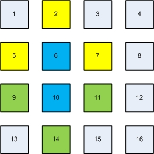

# Homework 1

Note: This homework is a modified version of an assignment from [CS 758 at University of Wisconsin-Madison](http://pages.cs.wisc.edu/~david/courses/cs758/Fall2016/wiki/index.php?n=Main.Homework1).

## DUE Thursday 4/18 before class (10:30am)

Useful links:

  - [SPLASH-2 paper](https://dl.acm.org/citation.cfm?id=223990)
  - [Intel's Closing the Ninja Gap paper](https://www.intel.com/content/dam/www/public/us/en/documents/technology-briefs/intel-labs-closing-ninja-gap-paper.pdf)
  - [LLNL OMP Documentation](https://computing.llnl.gov/tutorials/openMP/)

The purpose of the assignment is to give you experience writing simple shared memory programs using OpenMP.
This exercise is intended to provide a gentle introduction to parallel programming and will provide a foundation for writing and/or running much more complex programs on various parallel programming environments.

You are supposed to use the amarillo machine to get your code working for the final speedups and other results.
Your accounts are already setup on the machine.
You can ssh with your kerberos user ID and password.
(I.e., ssh [username]@amarillo.cs.ucdavis.edu).
Let Ayaz know via email or teams if you do not have an account.

**Important: When using amarillo, be sure to consider other users.**

1. This is a research machine used by students in the DArchR research group and beyond.
2. Other people in the class may be conducting experiments.

Follow these simple guidelines:

- Before running an experiment, check to see if anyone else is running an experiment with `top`. If you see a version of `ocean` running, wait a few minutes.
- Don't let your tests run for too long. Most tests should finish in < 1 minute and all tests should finish in < 5 minutes.
- If you see `gem5` processes running for a long period of time, let Jason know via Teams. We'll ask the current amarillo users to hold off on executing and long-running jobs.

Any questions about amarillo should be posted on the Teams portal.

## OpenMP

OpenMP is an API for shared-memory parallel programming for C/C++ and Fortran.
It consists of preprocessor (compiler) directives, library routines and environment variables that determine the parallel execution of a program.
For this assignment, you will use the GNU implementation of OpenMP that is already installed on amarillo.
You can find a good [introduction to OMP from LLNL](https://computing.llnl.gov/tutorials/openMP/) which explains both the basic concepts and complex use cases.
Remember to 
  - Use the flag -fopenmp for compilation and linking of your source files.

## Programming Task: Ocean Simulation

OCEAN is a simulation of large-scale sea conditions from the SPLASH benchmark suite.
It is a scientific workload used for performance evaluation of parallel machines.
For this assignment, you will write two scaled-down versions of the variant of the Ocean benchmark.

Ocean is briefly described in [SPLASH-2 paper](https://dl.acm.org/citation.cfm?id=223990) on the Reading List.
The scaled-down version you will implement is described below:

Our version of Ocean will simulate water temperatures using a large grid of integer values over a fixed number of time steps.
At each time step, the value of a given grid location will be averaged with the values of its immediate north, south, east, and west neighbors to determine the value of that grid location in the next time step (total of five grid locations averaged to produce the next value for a given location).

As illustrated in left figure below, value calculations for two adjacent grid locations are not independent.
Specifically, the value of the grid location number 6 is calculated using the values of the grid locations 6, 2, 7, 10, and 5, and the value of the grid location number 10 is calculated using the values of the grid locations 10, 6, 11, 14, and 9.
Because 6 depends on 10 and 10 depends on 6, the resulting values for 6 and 10 will depend on the order in which the values for 6 and 10 were calculated.

<p float="left">
  
   
</p>

The grid points in the ocean grid can be separated into two independent subsets shown in red and black in the right figure above.
Instead of calculating a new value for each grid location at every time step, the values for the grid points in the red subset are updated on even time steps and the values for the grid points in the black subset are updated on odd time steps.

The edges of the grid shown in green in the right figure above do not participate in the averaging process (they contribute a value, but their value does not change).
Thus, Ocean will converge (given sufficient runtime) to a gradient of the water temperatures on the perimeter of the grid.

## Template for your convenience for HW1

A [template](code) is provided for your convenience with basic setup of the program.
This template provides you the initialized data structure and timing instrumentation.
You are free to move the timing instrumentation in case you parallelize the initialization phase (not required).
A makefile has also been added to the template that will help you in compiling the code.
You might need to change the flags in the makefile during debug phase.
Do revert them back to allow compiler optimizations before submission.

**NOTE:** You are free to not use the template.
But do keep the initialization section the same, so that you have a 32-bit random number.

Download the template from [here](code) or clone this repository.

## Problem 1: Write Sequential Ocean (10 points)

Write a single-threaded (sequential) version of Ocean as described above.
This version of Ocean must take three arguments: the x-dimension of the grid, the y-dimension of the grid, and the number of time steps.
You may assume for simplicity that all grid sizes will be powers of two plus two (i.e. (2^n)+2); therefore the area of the grid that will be modified will be sized to powers of two (+2 takes care of the edges that are not modified).

You are required to make an argument that your implementation of Ocean is correct.
A good way to do this is to initialize the grid to a special-case starting condition, and then show that after a number of time steps the state of the grid exhibits symmetry or some other expected property.
You need not prove your implementation's correctness in the literal since.
However, please annotate any simulation outputs clearly.

Your final sequential version of Ocean should randomly initialize a grid of the requested size, then perform simulation for the specified number of time steps. 

## Problem 2: Write Parallel Ocean using OpenMP (10 points)

For this problem, you will use OpenMP directives to parallelize your sequential program.
You are required to use the schedule(dynamic) clause on loops that you will parallelize with OpenMP.
This will cause loop iterations to be dynamically allocated to threads.
Please be sure to explicitly label all appropriate variables as either shared or private.
Make an argument for the correctness of your implementation (it is acceptable to use the same argument as problem 1, provided it is still applicable).

The number of threads will be passed to the program based on an environment variable (`OMP_NUM_THREADS`).
To pass an environment variable to you program in a one-off fashion you can prepend it to the command line like:

```
 >>> OMP_NUM_THREADS=16 ./omp_ocean 8194 8194 100
```

For simplicity, you may assume that the dimensions of the grid are powers of two plus two as before, and that only `N=[1,2,4,8,16,24,48,96]` will be passed as the number of threads. 

## Problem 3: Analysis of Ocean (15 points)

Modify your programs to measure the execution time of the parallel phase of execution.

Compare the performance of your two Ocean implementations for a fixed number of time steps (100).
Plot the normalized (versus the sequential version of Ocean) speedups of your implementations on `N=[1,2,4,8,16,24,48,96]` threads for a 8194x8194 ocean.
Note that the N=1 case should be the sequential version of Ocean, not the parallel version using only 1 thread.
Repeat for an ocean sized to 16386x16386. 
(Note: Runtime for sequential should be less than 5 minutes.
If your runtime is longer than that, you may have a bug.)

## Problem 4: Parallelization using static partitioning of the grid (15 points)

In problem 2, you used OpenMP's automatic parallelization capabilities. However, in order to get good data locality, you might want to statically partition the Ocean grid into different regions and assign each region to a separate thread.

In this problem, you will need to implement a parallel version of Ocean that works on statically partitioned regions of data. In each time step, a thread would only update the grid cells belonging to its region.

Plot the speedups obtained with the static scheduling compared to the speedups obtained using dynamic implementation from problem 2.
For `N=24` threads and 100 time steps, use various Ocean sizes to identify the grid sizes where static partitioning performs better than dynamic partitioning.
Present arguments on why you think this is the case. Vary the chunk size for static scheduling, plot the results, and explain trends. 

## Problem 5: Architecture specific optimizations (Extra Credit)

After writing the serial and parallel versions of ocean, write another, optimized_ocean, which contains some architecture focused optimization.
Examples of this include, blocking the algorithm temporally or spatially to take advantage of caches, optimizing for special execution units like SIMD/SSE, and optimizing data layout for memory bandwidth.
[Closing the Ninja Gap](https://www.intel.com/content/dam/www/public/us/en/documents/technology-briefs/intel-labs-closing-ninja-gap-paper.pdf), an intel paper, describes these examples applied to many different algorithms and may help you get started.
Of course, amarillo is an AMD platform, so the optimizations may be a little different from the Intel paper above.
The AMD system supports AVX2 instructions, but it does not support AVX 512.

After implementing optimized_ocean, briefly (2 to 4 sentences) describe your optimization and how you applied it to ocean.
Plot the speedups obtained with your new optimization over sequential ocean for the same conditions as in Problem 3.
Also, for the same number of threads, plot the speedup of your optimized version over the un-optimized parallel ocean (from Problem 3 or 4).
Also include the overall "best" speedup obtained of your most optimized version of ocean compared to the serial version.

**Note:** We do not expect you to get 2x, or even 1.5x speedup here.
In fact, getting no speedup at all is a perfectly fine result.
Your answers to the questions and explanation for your results are what is important. 

## What to Hand In:

[Via canvas](...)
 - A *pdf* file with your answers to the above questions.
 - A gzipped tarball (e.g., `code.tgz`) with the code you used to answer the questions.

**You are expected to complete the assignment individually.**
However, you may discuss your solutions, your results (at a high level, not in detail), OMP best practices, etc. with one another.
**The code and answers to the questions must be completed individually.**
Feel free to use the class [Teams team](https://teams.microsoft.com/l/team/19%3ad6420d6da2ef421fb15ba63709562467%40thread.skype/conversations?groupId=077efc54-af37-496e-9405-8c7783fa2d3e&tenantId=a8046f64-66c0-4f00-9046-c8daf92ff62b) to discuss as well.
  
## Tips and Tricks:
  
   - Start early.
   - Amarillo is a dual-socket AMD Epyc server. It has two [AMD 7451](https://www.amd.com/en/products/cpu/amd-epyc-7451) processors with 24 cores per socket (48 total) and each is dual-threaded running at 2.3 GHz (3.2 GHz boost).
   - Run your programs multiple times (two or three times will do for the long running tests) to get accurate time measurements. This will help avoid incorrect results due to interference with other user's programs.
   - While making your measurements do take care that no-one else is running their program on the machine. Otherwise, it will provide you as well as the other person wrong results as well as longer runtimes.
   - Do not wait until the last day to run the experiments. You might not get time on the machine to get good results.
   - You may want to [set up ssh keys](http://csifdocs.cs.ucdavis.edu/about-us/csif-general-faq#TOC-How-do-I-set-up-SSH-keys-to-allow-me-to-login-to-the-CSIF-computers-without-a-password-) to save yourself some keystrokes by not having to type in your password every time.
